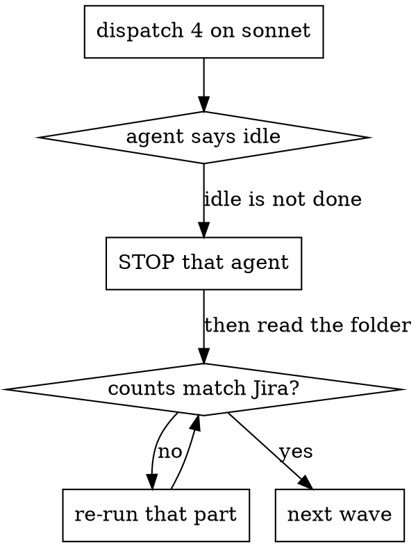

# Bulk pull

Many issues onto disk in one run — a sprint, a backlog, a JQL result.

[`pull.md`](pull.md) is the single-issue path and still governs what one folder must
contain. This workflow adds the part that only exists at scale: **how to know all of
them landed.** At one issue you read the folder yourself. At eighty you cannot, so
the run needs a check that does not depend on anyone's report.

**The one rule everything else follows from:** a subagent reporting success is a
hypothesis. The folder, checked against Jira, is the evidence.

---

## Step 1 [main]: Scope, and say it out loud

A sprint query returns far more than the user meant. Resolve it to a key list and
report the funnel before fetching anything.

```bash
node <skill-path>/scripts/jira-api.mjs get \
  "/rest/api/3/search/jql?jql=<JQL>&maxResults=100&fields=key,issuetype,status,summary"
```

Page it to the server's own total — `nextPageToken` until `isLast`. A short list here
silently becomes a short pull.

Then report, and get the decisions the user alone can make:

```
2062 issues in sprints 62-66
  885 on one team
    789 subtask types  → arrive inside their parent's tasks.md
     96 top-level      → one folder each
```

**Ask before fetching:** whether subtasks need their own folders (usually no — they
are already in `tasks.md`), and what to do about issue types the config has no entry
for. Both change the size of the run by an order of magnitude.

## Step 2 [main]: Triage unconfigured types

`fetch-issue.mjs` refuses a type the config does not describe, and it is right to:
guessing a field list produces a folder that looks complete and is not.

An unconfigured type **stops that issue, not the run.** Name them, pull the rest,
and list what was skipped in the final report. Adding them is
[`setup.md`](setup.md) step 6, which the user may or may not want mid-run.

## Step 3 [main]: Pilot one

Pull a single issue through [`pull.md`](pull.md) end to end and verify it yourself.
It proves credentials, config, field mapping and the format pass before the run
spends its API budget on eighty of them.

## Step 4 [main]: Waves

Dispatch **four at a time**, each on `sonnet`, each with the filled
[`../templates/subagent-instruction.md`](../templates/subagent-instruction.md).

Four is a working default, not a law: enough to overlap the slow parts, few enough
that a rate limit or a bad prompt costs one wave instead of the run.



### Stop the agent before you read its folder

An agent reports idle while it is still writing. Editing a file underneath a live
agent produces duplicated sections — two `## Linked Documents` headings in the same
`content.md`, each written by one of you.

A process listing is not a lock either: it can show nothing running while a write is
in flight. **Stop the agent explicitly, then read.** The stop is cheap; the
duplicate is silent.

### Verify each wave before dispatching the next

Per issue, against Jira, not against the report:

```bash
# worklogs: summed over the issue AND every subtask, because that is where the
# project logs time. A missing worklogs.md on an issue with 58 entries looks
# exactly like an issue with none.
node <skill-path>/scripts/jira-api.mjs count /rest/api/3/issue/<KEY>/comment
node <skill-path>/scripts/jira-api.mjs get "/rest/api/3/issue/<KEY>?fields=subtasks"

node <skill-path>/scripts/check-markdown.mjs \
  $(find <folder> -name '*.md' -not -path '*/assets/*')
```

Compare each to the `total:` in the file's own frontmatter:

| File | Must equal |
|---|---|
| `comments.md` | the `/comment` endpoint's `total` |
| `tasks.md` | the issue's own subtask count |
| `worklogs.md` | worklog entries summed over the issue and every subtask |
| `content.md` | one link per file in `confluence/` |

Any mismatch is a failed part. Re-run that one part — writes overwrite, so
re-fetching is always safe — and check again before moving on.

Per-wave, not at the end. A wave costs one re-run to fix; a silent gap found at the
end of the run costs a re-verification of everything after it.

## Step 5 [main]: Sweep every folder

The per-wave check catches what its wave produced. The sweep catches what the
per-wave check itself got wrong.

Walk every folder once more: the four counts, the gate, and Confluence link
coverage. A finding that survives is either a real defect or one of the documented
refusals — `WCAG-2.4.4` on link text the author wrote, `heading-punct` where the
issue summary itself ends in a period. Name which, per issue.

## Step 6 [main]: Report

- how many issues, and the funnel from step 1
- every issue skipped, and why (unconfigured type, permissions, 404)
- every count verified, as `file = Jira`
- every finding left open, with the reason it is a refusal rather than a defect
- anything repaired mid-run, and how it was found

---

## What goes wrong at scale

Each of these happened in an 80-issue run through this skill.

| Failure | What it looked like | What catches it |
|---|---|---|
| Agent quit after part 1 | Folder with `content.md` only; agent reported done | Wave verification: `worklogs.md` absent on an issue with 58 entries |
| Agent delegated to its own subagent | Empty folder, success report | Same check; the prompt now forbids delegating |
| Agent reported idle mid-write | Duplicate `## Linked Documents` after the main thread edited | Stop the agent first |
| Confluence page pulled, never linked | Page on disk, nothing pointing at it | Link coverage — the gate cannot see this |
| Gate command silently skipped | `*.md` glob matched nothing; zsh aborted the command | `find`, never a glob |
| Attachments gated as if they were output | 24 findings on a correct folder | `-not -path '*/assets/*'` |

**One partial folder is worse than one missing folder.** A missing folder is
obvious. A folder holding four of five files reads as finished.
